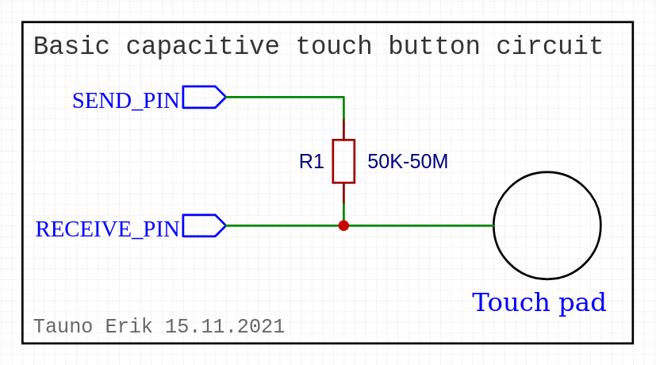

# Arduino Capacitive Touch Library

Basic Arduino Capacitive Touch library.

This is useful if, for example, you want to use apples as input buttons. Or metal foil or something else that conducts electricity.

Send pin can be the same when using multiple touch buttons.

## Circuit



## Example code

```c++
#include <Tauno_capacitive_touch.h>

const uint32_t BAUD_RATE = 115200;

const int SEND_PIN = 0;    // Rasperry Pi Pico GP0
const int RECEIVE_PIN = 1; // Rasperry Pi Pico GP1

Tauno_capacitive_touch Sensor(SEND_PIN, RECEIVE_PIN);

void setup() {
  Serial.begin(BAUD_RATE);
  Serial.println("Capacitive touch button demo!");
  Sensor.begin();
}

void loop() {
  // Read raw value
  uint32_t value1 = Sensor.read_raw();
  Serial.print(" Sensor.read_raw():");
  Serial.print(value1);

  // Read calibrated value 0=no touch or higher=touch
  uint32_t value2 = Sensor.read();
  Serial.print(" Sensor.read():");
  Serial.print(value2);

  // Read boolean: 0=false=no touch or 1=true=touch
  bool value3 = Sensor.read_bool();
  Serial.print(" Sensor.read_bool():");
  Serial.println(value3);

  delay(50);
}
```

## Demo

## Tested

|Borad|Tested|
|:-|:-|
|Rasperry Pi Pico|Works|

__

Copyright Tauno Erik 2021 [taunoerik.art](https://taunoerik.art/)
